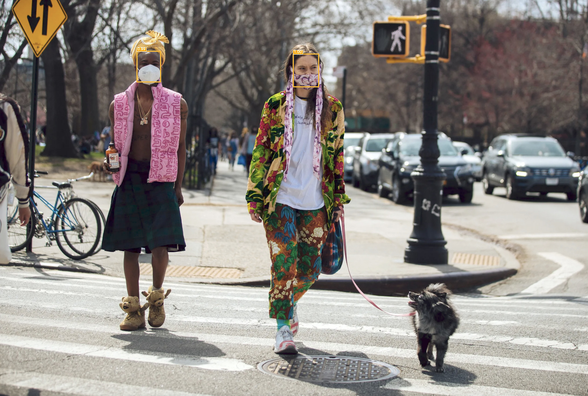

# deepface-fastapi

## Introduction

This is a simple project to detect human faces in an image using deepface and fastapi.



## Requirements

- Python 3.6+
- Debian / MacOS

## Reference

- [DeepFace](https://github.com/serengil/deepface): A Lightweight Face Recognition and Facial Attribute Analysis (Age, Gender, Emotion and Race) Library for Python.

## Install

```bash
pip3 install fastapi
pip3 install "uvicorn[standard]"
pip3 install python-multipart
pip3 install numpy
pip3 install opencv-python-headless
pip3 install retinaface==1.1.1
pip3 install deepface
pip3 install tf-keras
```

## Usage

### Detect and return image file

```bash
curl --location 'http://127.0.0.1:8008/detect_and_return' \
--form 'file=@"/Users/luolei/Desktop/human-image-example.jpg"'
```

The response will be a image file with faces detected.

### Detect Image and return json

```bash
curl --location 'http://127.0.0.1:8008/analyze' \
--form 'file=@"/Users/luolei/Desktop/human-image-example.jpg"'
```

The response will be a json like below:

```json
{
  "status": "success",
  "faces_detected": 1,
  "faces": [
    {
      "position": {
        "x": 943,
        "y": 1126,
        "w": 131,
        "h": 178
      },
      "confidence": 0.9973875284194946,
      "age": 29,
      "gender": "Woman",
      "dominant_race": "asian",
      "dominant_emotion": "neutral",
      "emotion": {
        "angry": 2.710123546421528,
        "disgust": 7.478310748432193e-8,
        "fear": 2.3377612233161926,
        "happy": 0.0003928863861801801,
        "sad": 12.757988274097443,
        "surprise": 0.0003206779865649878,
        "neutral": 82.1934163570404
      },
      "race": {
        "asian": 99.99648332595825,
        "indian": 0.0013003231288166717,
        "black": 3.5335065429187296e-8,
        "white": 5.535627565222967e-5,
        "middle eastern": 7.717589761702115e-9,
        "latino hispanic": 0.002161472184525337
      }
    }
  ],
  "output_file": "/Users/luolei/Desktop/result_20241105_155522.jpg"
}
```
